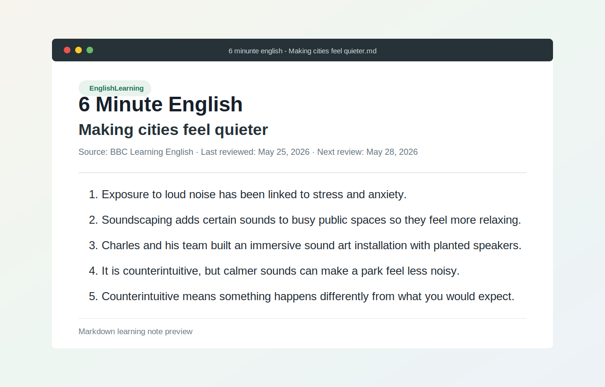

# English Learning Notes

A small collection of English-learning notes based on BBC Learning English episodes. Each note captures the source material, review schedule, key ideas, and useful vocabulary or sentence patterns for later revision.



## Current Note

- **Topic:** 6 Minute English - Making cities feel quieter
- **Source:** [BBC Learning English](https://www.bbc.co.uk/learningenglish/english/features/6-minute-english_2026/ep-260521)
- **Last reviewed:** May 25, 2026
- **Next review:** May 28, 2026
- **Focus:** noise, stress, soundscaping, public spaces, and the word `counterintuitive`

## Project Structure

```text
.
├── README.md
├── assets/
│   └── note-preview.svg
└── 6 minunte english - Making cities feel quieter.md
```

## Note Format

Each Markdown note uses front matter for learning metadata:

```yaml
tags:
  - EnglishLearning
Last reviewed: May 25, 2026
Next review: May 28, 2026
```

The main body usually includes:

- the episode title
- the original learning source
- transcript or episode reference information
- important ideas from the episode
- vocabulary explanations and example sentences

## How To Use

1. Open a note and listen to the linked BBC Learning English episode.
2. Read the transcript or episode summary.
3. Review the numbered sentences and rewrite unclear grammar or vocabulary.
4. Update `Last reviewed` and `Next review` after each study session.
5. Add new notes using the same Markdown structure.

## Suggested Improvements

- Rename files with consistent spelling and date prefixes, for example `2026-05-21-making-cities-feel-quieter.md`.
- Separate vocabulary, grammar notes, and personal example sentences into clear sections.
- Add more screenshots or rendered previews as the note collection grows.
